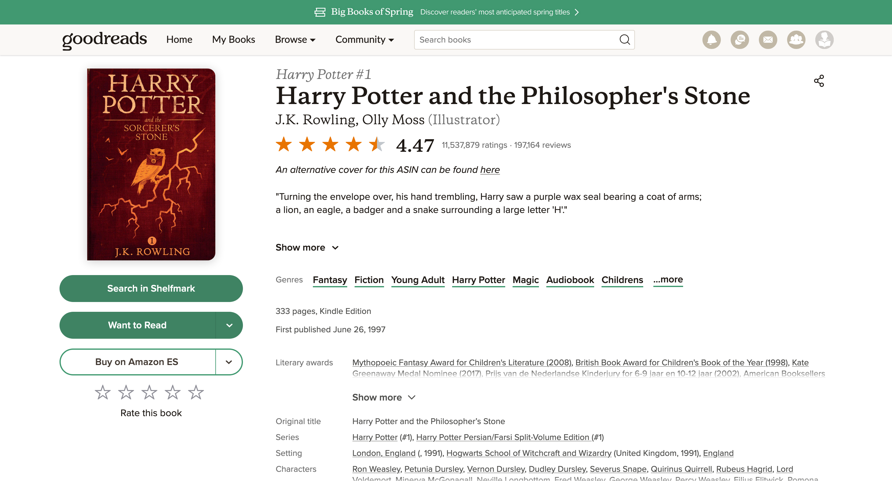
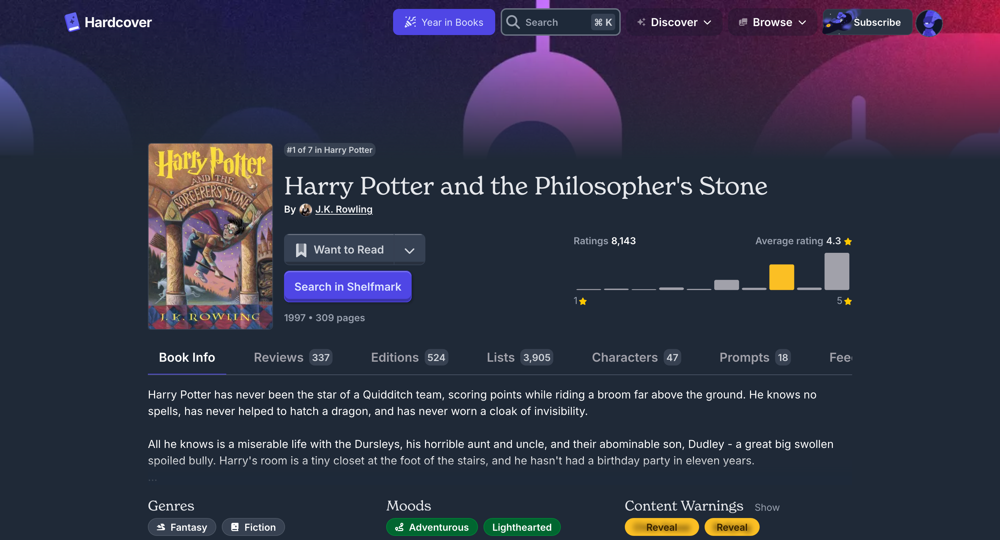
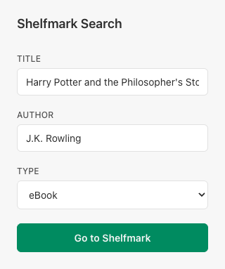
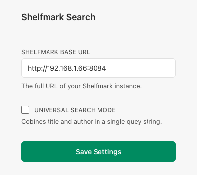

# Shelfmark Search

Browser extension that adds a **Search in Shelfmark** button to book pages, so you can jump directly from discovery sites to your [Shelfmark](https://github.com/calibrain/shelfmark) library search.

## Features

- Adds a one-click Shelfmark search button on supported book pages.
- Supports both in-page button injection and popup-based search.
- Works in both Chromium-based browsers and Firefox.

## Supported Sites

- Goodreads (`goodreads.com/book/show/...`)
- Hardcover (`hardcover.app/books/...`)
- StoryGraph (`app.thestorygraph.com/books/...`)
- More sites coming soon! Open an issue if you'd like to see support for a specific site.

## Screenshots

<div align="center">
  <table border="0">
    <tr>
      <td align="center" valign="middle" width="48%">
        
      </td>
      <td align="center" valign="middle" width="48%">
        
      </td>
    </tr>
  </table>
  <p><em>Goodreads and Hardcover integrations</em></p>
</div>

<div align="center">
  <table border="0">
    <tr>
      <td align="center" valign="middle" width="48%">
        
      </td>
      <td align="center" valign="middle" width="48%">
        
      </td>
    </tr>
  </table>
  <p><em>Extension popup and settings views</em></p>
</div>

## Installation

### Browser Marketplaces

[link-chrome]: https://chromewebstore.google.com/detail/shelfmark-search/pmnpkbmgkdlfdlkciechfpnaanigonbf 'Version published on Chrome Web Store'
[link-firefox]: https://addons.mozilla.org/firefox/addon/shelfmark-search/ 'Version published on Mozilla Add-ons'

[][link-chrome] [][link-chrome] and other Chromium browsers

[][link-firefox] [][link-firefox] on Firefox for desktop

### Download from Releases

1. Go to [GitHub Releases](https://github.com/pruizlezcano/shelfmark-search/releases/latest).
2. Download the ZIP for your browser:
   - Chromium: `shelfmark-search-*.zip`
   - Firefox: `shelfmark-search-firefox-*.zip`
3. Load it as an unpacked/temporary extension in your browser.

### Build from Source

#### Prerequisites

- [Bun](https://bun.sh/)

#### Steps

```bash
git clone https://github.com/pruizlezcano/shelfmark-search.git
cd shelfmark-search
bun install
```

Run in development mode:

```bash
bun run dev
```

Build production bundles:

```bash
bun run build
bun run build:firefox
```

Create distributable ZIPs:

```bash
bun run zip
bun run zip:firefox
```

Build output is generated in `.output/`.

## Usage

1. Open a supported book page on Goodreads or Hardcover.
2. Click **Search in Shelfmark**.
3. A new tab opens with your Shelfmark search results.

You can also open the extension popup to adjust:

- Title
- Author
- Format (`ebook` or `audiobook`)

## Configuration

Open the extension options page and set:

- **Shelfmark Base URL**: Your Shelfmark instance URL (for example, `https://shelfmark.example.com`).
- **Universal Search Mode**:
  - Enabled: sends one combined query (`q=title author`)
  - Disabled: sends separate title/author params (`q=title&author=...`)

If the base URL is not configured, clicking the button opens the options page.

## Query Format

The extension opens your Shelfmark instance with:

- `content_type` (`ebook` or `audiobook`)
- `q` (title or combined text)
- `author` (when Universal Search Mode is disabled)

Example:

```text
https://your-shelfmark-url/?content_type=ebook&q=Dune&author=Frank%20Herbert
```

## Development Scripts

- `bun run dev` - Start dev mode (Chromium)
- `bun run dev:firefox` - Start dev mode (Firefox)
- `bun run build` - Build (Chromium)
- `bun run build:firefox` - Build (Firefox)
- `bun run zip` - Package ZIP (Chromium)
- `bun run zip:firefox` - Package ZIP (Firefox)
- `bun run compile` - TypeScript check
- `bun run test:e2e` - Build and run Playwright E2E tests

## E2E Testing

This project uses Playwright for extension-level E2E tests against the built Chromium bundle in `.output/chrome-mv3`.

Install Chromium for Playwright (first time only):

```bash
bunx playwright install
```

Run E2E tests:

```bash
bun run test:e2e
```

## Troubleshooting

- **Button does not appear**: Refresh the page and make sure the URL matches a supported site pattern.
- **Search opens options instead of results**: Set a valid Shelfmark base URL in extension settings.
- **No/incorrect title or author**: Open the popup and edit fields manually before searching.

## Need help?

For support or feature suggestions, visit the [GitHub Issues](https://github.com/pruizlezcano/shelfmark-search/issues) page.
